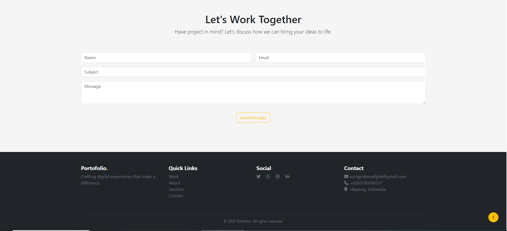

# Website Portofolio

Sebuah website portofolio pribadi yang menampilkan karya, layanan, dan latar belakang saya sebagai UI Designer & Front-End Developer. Proyek ini berfungsi sebagai ruang digital untuk mendemonstrasikan kemampuan saya dalam desain antarmuka dan pengembangan web front-end. Situs ini responsif, dioptimalkan untuk tampilan mobile dan desktop, serta memuat bagian-bagian penting untuk mempresentasikan karya, menawarkan layanan, dan memudahkan pengunjung untuk menghubungi saya. Proyek ini sepenuhnya dibangun menggunakan teknologi front-end tanpa integrasi back-end.

---
Demo :  https://suriapratama0-project.github.io/portofolio-bootstrap-javascript/
---

## Daftar Isi

- [Fitur Baru v2.0 (Updated)](#fitur-baru-v2.0-(updated))  
- [Fitur](#fitur)  
- [Teknologi yang Digunakan](#teknologi-yang-digunakan)  
- [Struktur Proyek](#struktur-proyek)
- [Penjelasan struktur](#penjelasan-struktur)  
- [Tangkapan Layar](#tangkapan-layar)  
- [Informasi Kontak](#informasi-kontak)  
- [Lisensi](#lisensi)  
- [Tautan Sosial](#tautan-sosial)  
- [Ucapan Terima Kasih](#ucapan-terima-kasih)  

---

## Fitur Baru v2.0 (Updated) 
- **Penambahan Margin**: Layout diperbaiki agar jarak antar elemen lebih proporsional, terutama di bagian kartu proyek dan teks About. 
- **Foto Profil Baru**: Update gambar profil terbaru di bagian About Me. 
- **Fitur Read More**: Setiap kartu project kini memiliki tombol Read More untuk menampilkan deskripsi lengkap tanpa merusak layout halaman.
- **Link Project**: Setiap project memiliki tautan langsung ke demo atau repository GitHub.
- **Deskripsi Proyek Lengkap**: Setiap project sekarang memuat detail teknologi, fitur, dan hasil implementasi.
- **Penambahan Project Baru**: Menambah project terbaru untuk menampilkan variasi portofolio.
- **Rapi dan Terstruktur**: Perbaikan teks dan layout agar lebih konsisten dan mudah dibaca.
- **Sistem Kirim Pesan via Email**: Contact form sekarang terhubung ke FormSubmit, memungkinkan pengunjung mengirim pesan langsung ke email tanpa back-end.

## Fitur

- **Navigasi**: Bar navigasi sederhana dan intuitif untuk mengakses bagian Home, Work, About, Services, dan Contact. Responsif dan mendukung tampilan mobile.
- **Hero Section**: Tampilan awal yang menarik dengan judul besar, deskripsi singkat tentang profesi, serta tombol ajakan untuk melihat karya dan menghubungi.
- **Work (Project)**: Galeri tiga project unggulan dalam bentuk kartu, masing-masing dengan gambar, judul, dan deskripsi singkat untuk menunjukkan hasil karya.
- **About Me**: Bagian perkenalan diri yang mencakup foto profil, ringkasan profesional, daftar skill, dan tools yang digunakan.
- **Services**: Menampilkan layanan yang ditawarkan seperti UI/UX Design, Web Development, dan Mobile Design dalam format kartu informatif.
- **Contact Form**: Formulir untuk pengunjung yang ingin menghubungi, terdiri dari input nama, email, subjek, dan pesan.
- **Footer**: Informasi tambahan seperti deskripsi brand, link cepat, media sosial, dan detail kontak termasuk email, WhatsApp, dan lokasi.
- **Back to Top Button**: Tombol untuk kembali ke bagian atas halaman dengan sekali klik, memudahkan navigasi pengguna.

---

## Teknologi yang Digunakan

- **HTML5**: Struktur konten menggunakan tag semantik untuk SEO dan aksesibilitas.
- **CSS3**: Styling halaman menggunakan properti modern seperti flexbox dan grid.
- **Bootstrap 5**: Framework CSS untuk membuat layout responsif dan komponen UI siap pakai seperti navbar, card, dan tombol.
- **JavaScript**: Digunakan untuk interaksi dasar seperti tombol "Back to Top" dan kemungkinan validasi form.
- **Font Awesome**: Library ikon berbasis CSS untuk menambahkan ikon media sosial dan ikon navigasi.
- **Custom CSS (style.css)**: Untuk menyesuaikan desain visual di luar framework Bootstrap.
- **Custom JavaScript (main.js)**: Untuk logika tambahan seperti efek animasi atau interaktivitas tombol.

---

## Struktur Proyek

```
portofolio-bootstrap-javascript/
├── index.html
├── README.md
├── assets/
│   ├── css/
│   │   ├── bootstrap.min.css
│   │   ├── style.css
│   ├── js/
│   │   ├── bootstrap.min.js
│   │   ├── main.js
│   ├── images/
│   │   ├── 1.png
│   │   ├── 2.png
│   │   ├── 3.png
│   │   ├── Photoroom-20250203_121514.png
│   ├── fonts/ (opsional — jika kamu self-host Font Awesome)
│   │   ├── all.min.css
│   │   └── [file font terkait]
│
└── (opsional) README.md
```

## Penjelasan struktur

- **index.html**: Halaman utama website yang berisi struktur konten portofolio menggunakan HTML5 dan tag semantik.
- **assets/css/**: Folder untuk file stylesheet seperti bootstrap.min.css dan style.css yang digunakan untuk styling tampilan.
- **assets/js/**: Folder untuk file JavaScript seperti bootstrap.min.js dan main.js yang menangani interaktivitas dan komponen dinamis.
- **assets/images/**: Berisi semua aset gambar yang digunakan dalam proyek seperti gambar proyek, foto profil, dan ilustrasi.
- **assets/fonts/ (opsional)**: Tempat menyimpan file font atau ikon lokal seperti Font Awesome jika tidak menggunakan CDN.
- **README.md**: File dokumentasi proyek yang menjelaskan deskripsi, cara penggunaan, teknologi yang digunakan, dan informasi tambahan lainnya.

---

## Tangkapan Layar
#### Halaman Utama


#### Halaman Project


#### Halaman About


#### Halaman Jasa


#### Halaman Footer


---

## Informasi Kontak
Jika Anda tertarik bekerja sama atau memiliki pertanyaan, hubungi saya:
- Email: suriapratama0job@gmail.com
- WhatsApp: +62 831-9026-0337
- Lokasi: Cikarang, Indonesia

---

## Lisensi
Proyek ini dilisensikan di bawah **MIT License**. Lihat file [LICENSE](LICENSE) untuk detail.

---

## Tautan Sosial
Terhubung dengan saya di:
- [LinkedIn](https://www.linkedin.com/in/suria-pratama-97805434b/)
- [Twitter](https://x.com/SuriaPratama0)
- [Instagram](https://www.instagram.com/suria_pratama0/)
- [Dribbble]

---

## Ucapan Terima Kasih
- Font Awesome: Ikon yang digunakan di seluruh situs.
- Figma: Proses desain UI/UX dan wireframe.
- Inspirasi dari berbagai situs portofolio profesional.
- Terima kasih untuk semua masukan dan dukungan.
